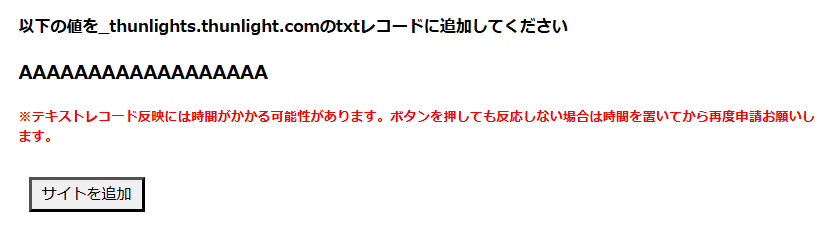

# ThunLightsアカウントを用意

ThunLights Oauthの利用にはThunLightsアカウントが不可欠です。

アカウント作成やサイト連携などについて解説します。

## アカウント作成

ThunLights Oauthの利用にはThunLightsアカウントが必要になります。
未登録の方は[こちら](https://thunlights.com/register)から登録お願いします。

## あなたのドメインを有効化

ここからは実際に有効化する際の手順を説明していきます。

### ドメイン追加ページまで行く

ThunLightsに登録後は[アカウントページ](https://thunlights.com/account)へ行ってください。

その後、以下の手順でサイトを追加ページまで行ってください

アカウントページ -> Oauth 2.0 -> サイトを追加

### 実際に有効化する

ドメインとリダイレクト先を指定できると思うのでドメイン(example.com)とリダイレクト先(https://example.com/callback) を入力してください。

**※リダイレクト先にOauthの為に必要なコードがクエリに入って渡されます。**

サイトを追加ボタンを押すと以下のようにtxtレコードを設定する旨のメッセージが出てくるので設定しましょう

txtレコード追加後にサイトを追加ボタンを再度押すと追加が完了されると思います。アカウントページのOauth 2.0の欄にドメインが追加されていれば成功です。

## 利用の際に必要な情報

Oauth2.0で使いたいドメインの横にある詳細ボタンをクリックしてください。
そうするとシークレットコードなどが閲覧できるページに飛ばされると思います。

そのシークレットコードがThunLights Oauthを利用するうえで鍵になってきますので、対応するドメインと一緒にメモしておいてください
