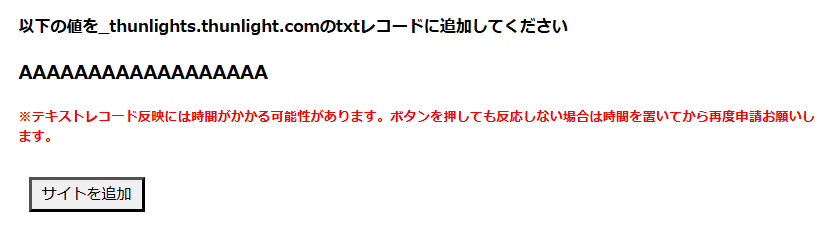

# Prepare Your ThunLights Account

A ThunLights account is essential for using ThunLights Oauth.

This section explains how to create an account and link your domain.

## Account Creation

To use ThunLights Oauth, you need a ThunLights account.
If you are not registered, please sign up [here](https://thunlights.com/register).

## Activate Your Domain

Next, I will explain the steps to activate your domain.

### Go to the Domain Addition Page

After registering with ThunLights, please go to the [account page](https://thunlights.com/account).

Then, follow these steps to reach the domain addition page:

Account Page -> Linked Domains -> Add Domain

### Actually Activate It

You should be able to enter your domain, so please input your domain (example.com).

When you click the "Add Domain" button, a message will appear indicating that you need to set up a TXT record, so please do that.

After adding the TXT record, click the "Add Domain" button again, and the addition should be completed. If your domain appears in the Linked Domains section of the account page, you have succeeded.

## Add OAuth 2.0 Application

Follow these steps to reach the domain addition page:

Account Page -> OAuth 2.0 Applications -> Add Application

You should be able to specify the redirect URL, so please do that.
The domains that can be used as redirect URLs here are only localhost or those registered as linked domains.

**Note: The necessary code for OAuth will be passed in the query to the redirect URL.**

## Information Required for Use

Click the details button next to the application you want to use with Oauth2.0.
This will take you to a page where you can view the secret code and other information.

This secret code is key to using ThunLights Oauth, so please make a note of it along with the corresponding domain.
